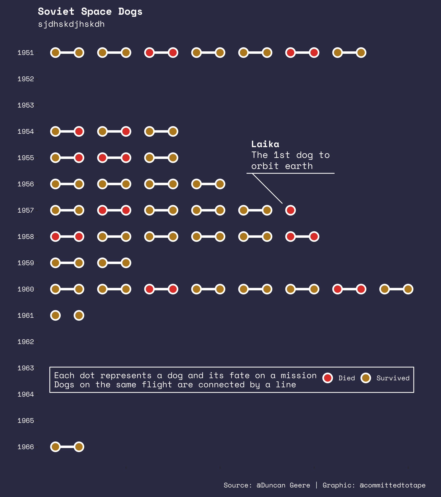

# soviet-space-dogs
Data clean and visualisation of soviet space dogs data.

## The Data
The data has been sourced from [here](https://airtable.com/universe/expG3z2CFykG1dZsp/sovet-space-dogs). Collated by [Duncan Geere](https://twitter.com/duncangeere).

## Data Clean
`dogs_clean.R` and `flights_clean.R` perform some data cleaning/tidying steps to prepare the data for plotting. Makes use of `tidyr`, `stringr`, `lubridate` and `janitor`.

## Data Viz
`dog_flight_plot.R` creates the data visualisation saved as `soviet_space_dogs.png`. Built with `ggplot2`, `ggforce`, `ggtext` and `showtext`.

## This is all a bit incoherent, can you give me more?
Blog post on the cleaning/tidying steps can be found here:
[https://davidsmale.netlify.com/portfolio/soviet-space-dogs-part-1/](https://davidsmale.netlify.com/portfolio/soviet-space-dogs-part-1/)

Blog post on the data visualisation coming soon...

